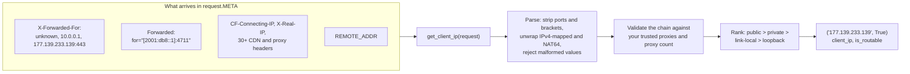
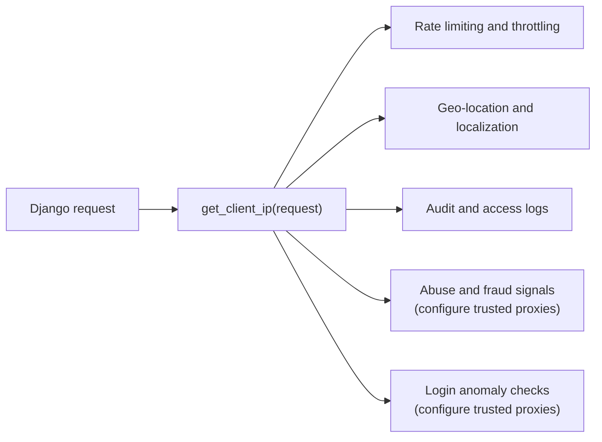
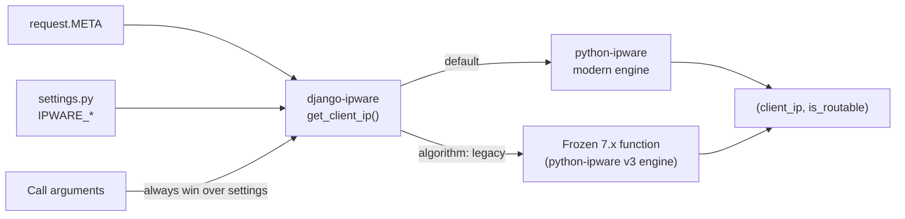
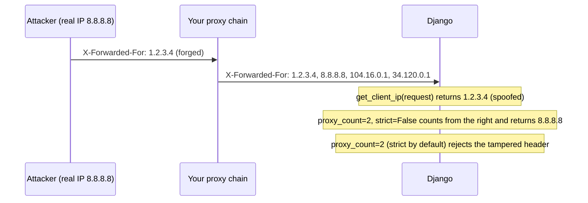
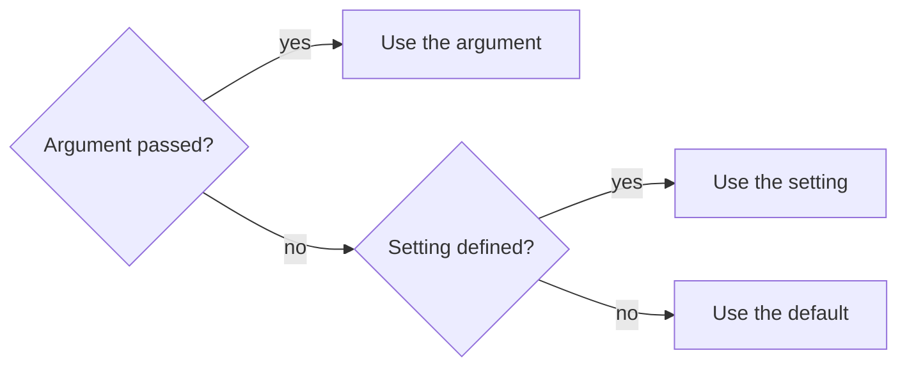
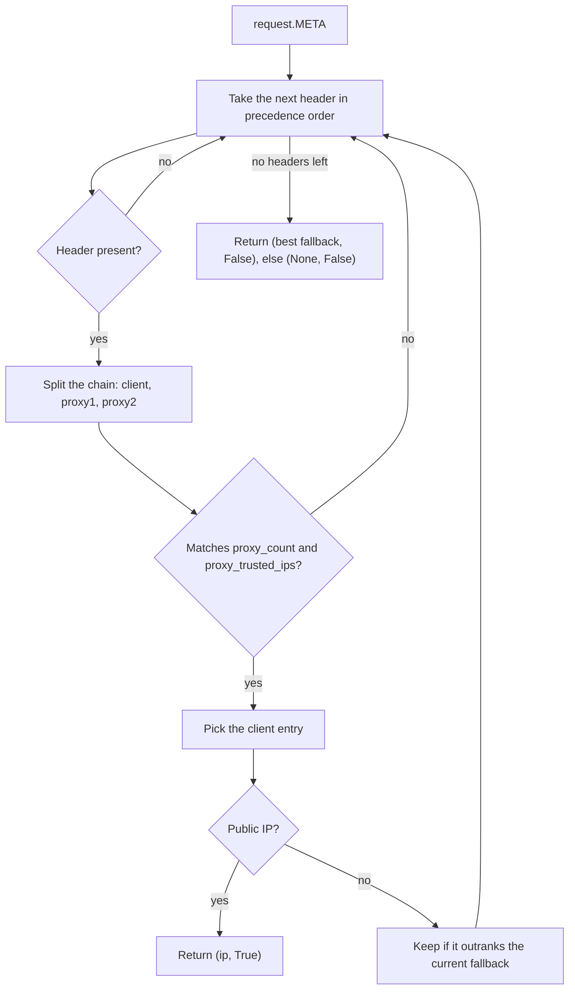
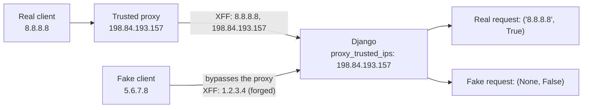
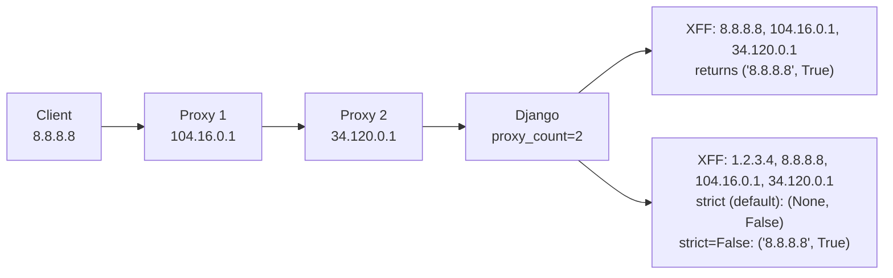
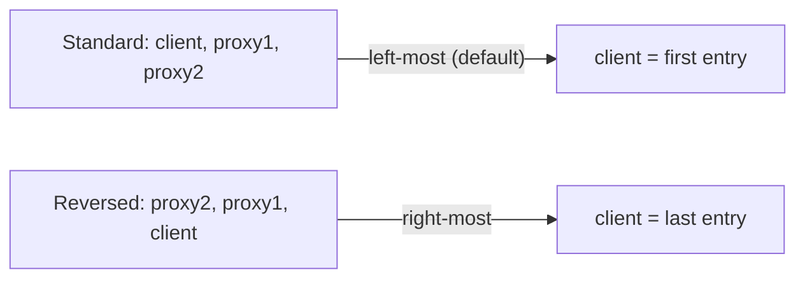
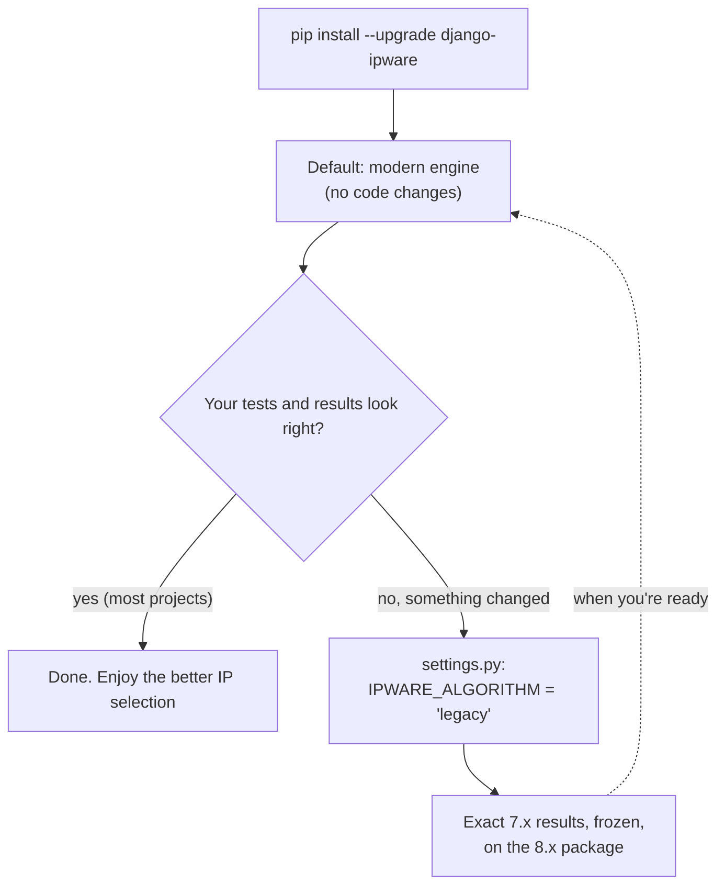

# Django IPware

Best-effort client IP detection for Django — one call, in any view or middleware.

[![status-image]][status-link]
[![version-image]][version-link]
[![coverage-image]][coverage-link]
[![maintained-image]][maintained-link]

## Quickstart

```sh
python -m pip install --upgrade django-ipware
```

```python
from ipware import get_client_ip

client_ip, is_routable = get_client_ip(request)

if client_ip is None:
    ...  # no usable IP in the request
elif is_routable:
    ...  # a public internet address
else:
    ...  # private, link-local or loopback (intranet, VPN, local dev)
```

`client_ip` is a string such as `"177.139.233.139"` or `"2606:4700::1"`, or `None`.

Python 3.10+ and Django 5.2+ are supported (tested on Python 3.10 – 3.14 with Django 5.2, 6.0 and 6.1).
On older Python or Django versions, use `django-ipware<8`.

> **Not using Django, or want more control?** django-ipware is powered by
> [python-ipware](https://github.com/un33k/python-ipware), and you can use it directly in Django, Flask,
> FastAPI or any WSGI/ASGI app. It also returns a `trusted_route` flag and `ipaddress` objects.

> **Legacy:** the frozen 7.x behavior is still available with `algorithm="legacy"` or
> `IPWARE_ALGORITHM = "legacy"`. See [Upgrading from 7.x](#upgrading-from-7x).

## What you get

Messy, forgeable request headers in; one clean, ranked client IP out.



## What it's used for



## How it fits together



## Security notice

> **Found a security issue?** Please email **info@neekware.com** privately — do not open a public
> issue or pull request. See [SECURITY.md](https://github.com/un33k/django-ipware/blob/master/SECURITY.md).

There is no perfect defense against IP address spoofing. Headers such as `X-Forwarded-For` are set by
clients and proxies, and can be forged. If you use `django-ipware` for authentication, rate limiting,
or anti-fraud, configure `proxy_trusted_ips` and/or `proxy_count` for your network topology and treat
it as one layer alongside your firewall — never as the only defense.



## API

```python
get_client_ip(
    request,
    proxy_order="left-most",     # or "right-most"
    proxy_count=None,            # expected number of proxies in front of Django
    proxy_trusted_ips=None,      # trusted proxies: IPs, CIDR networks or prefixes
    request_header_order=None,   # header keys to check, in order
    strict=None,                 # strict chain validation; default True
    algorithm=None,              # default "modern"; "legacy" for exact 7.x results
)
```

| Argument | Description |
| --- | --- |
| `proxy_order` | `"left-most"` (default) follows the de-facto `client, proxy1, proxy2` order. Use `"right-most"` only for networks that put the client last. |
| `proxy_count` | Number of proxies expected after the client. `0` is valid; `None` disables the check. |
| `proxy_trusted_ips` | Trusted proxies nearest Django, one entry per hop. Each entry is a CIDR network (`"100.64.0.0/10"`), a complete IP matched exactly (`"198.84.193.157"`), or an IP prefix matched on whole octets (`"10.1."`). See [Trusted proxies](#trusted-proxies). |
| `request_header_order` | Header keys to search, top to bottom. Defaults to the list below. |
| `strict` | `True` (default): exactly `proxy_count` proxies, and any malformed entry rejects that header. `False`: at least that many, and bad entries are skipped. |
| `algorithm` | `"modern"` (default) uses the modern engine; `"legacy"` runs the frozen 7.x function. |

| Output | Description |
| --- | --- |
| `client_ip` | The client IP as a string, or `None` |
| `is_routable` | `True` when `client_ip` is a publicly routable address |

An invalid value raises `ValueError`: an unknown `proxy_order` or `algorithm`, a trusted proxy list
passed as a bare string, an empty or non-IP entry, a negative `proxy_count`, and so on.

### Settings

Each setting applies only when the matching argument is not passed. **An explicit argument always wins.**

| Setting | Argument | Default |
| --- | --- | --- |
| `IPWARE_ALGORITHM` | `algorithm` | `"modern"` |
| `IPWARE_META_PRECEDENCE_ORDER` | `request_header_order` | the list below |
| `IPWARE_META_PROXY_COUNT` | `proxy_count` | not enforced |
| `IPWARE_STRICT` | `strict` | `True` |



### Selection rules

Headers are checked in precedence order. Every address is ranked:

| Rank | Addresses | `is_routable` |
| --- | --- | --- |
| 1. public | globally routable | `True` |
| 2. private | RFC 1918, IPv6 ULA, CGNAT `100.64.0.0/10`, documentation ranges | `False` |
| 3. link-local | `169.254.0.0/16`, `fe80::/10` | `False` |
| 4. loopback | `127.0.0.0/8`, `::1` | `False` |
| never returned | `0.0.0.0`, `::`, multicast, broadcast, reserved | — |

The first **public** IP wins. If none is found, the best-ranked IP wins, and the earlier header wins a
tie.

Within one header, the client entry depends on your proxy settings:

- **`proxy_count` / `proxy_trusted_ips` set:** the entry just before your trusted proxies.
- **Neither set:** the first public entry in the chain, not only the first entry. So
  `10.0.0.1, 177.139.233.139` yields `177.139.233.139`. That entry may be an upstream proxy rather than
  the client. If you need to identify private clients (intranet, VPN), set `proxy_count` or
  `proxy_trusted_ips` so the client position is fixed.



Ports are stripped (`1.2.3.4:8080`, `[2001:db8::1]:443`). IPv4-mapped (`::ffff:1.2.3.4`) and NAT64
well-known-prefix (`64:ff9b::1.2.3.4`) addresses are returned as plain IPv4. RFC 7239 `Forwarded`
elements are read by their `for=` value (`for="[2001:db8::1]:4711";proto=https`). Malformed tokens such
as `[::1`, `[::1]junk`, or `1.2.3.4:abc` are rejected rather than truncated.

## Default header precedence

```python
(
    "X_FORWARDED_FOR",           # load balancers / proxies (AWS ELB, etc.)
    "HTTP_X_FORWARDED_FOR",
    "HTTP_CLIENT_IP",            # Amazon EC2, Heroku
    "HTTP_X_REAL_IP",
    "HTTP_X_FORWARDED",          # Squid
    "HTTP_X_CLUSTER_CLIENT_IP",  # Rackspace LB, Riverbed Stingray
    "HTTP_FORWARDED_FOR",        # de facto variant
    "HTTP_FORWARDED",            # RFC 7239
    "HTTP_CF_CONNECTING_IP",     # Cloudflare
    "HTTP_TRUE_CLIENT_IP",       # Cloudflare Enterprise, Akamai
    "HTTP_FASTLY_CLIENT_IP",     # Fastly, Firebase
    "HTTP_FLY_CLIENT_IP",        # Fly.io
    "HTTP_X_APPENGINE_USER_IP",  # Google App Engine
    "X-CLIENT-IP",               # Microsoft Azure
    "X-REAL-IP",                 # NGINX
    "X-CLUSTER-CLIENT-IP",       # Rackspace Cloud Load Balancers
    "X_FORWARDED",
    "FORWARDED_FOR",
    "CF-CONNECTING-IP",
    "TRUE-CLIENT-IP",
    "FASTLY-CLIENT-IP",
    "FLY-CLIENT-IP",
    "FORWARDED",
    "CLIENT-IP",
    "HTTP_X_CLIENT_IP",          # Microsoft Azure (Django/WSGI form)
    "X-APPENGINE-USER-IP",       # Google App Engine (raw form)
    "HTTP_X_AZURE_CLIENTIP",     # Azure Front Door
    "X-AZURE-CLIENTIP",
    "HTTP_DO_CONNECTING_IP",     # DigitalOcean App Platform
    "DO-CONNECTING-IP",
    "HTTP_X_ENVOY_EXTERNAL_ADDRESS",  # Envoy / Istio
    "X-ENVOY-EXTERNAL-ADDRESS",
    "REMOTE_ADDR",               # direct connection
)
```

This list comes from python-ipware. Headers released earlier never move, so an upgrade can never let a
new header outrank one that already resolved your requests.

Narrow it to what your infrastructure actually sets:

```python
# settings.py
IPWARE_META_PRECEDENCE_ORDER = ("HTTP_X_FORWARDED_FOR", "REMOTE_ADDR")
```

If **all** your traffic comes through a CDN, put its header first. Only do this when Django is not
reachable directly, because clients can send these headers themselves:

```python
# settings.py: behind Cloudflare only
IPWARE_META_PRECEDENCE_ORDER = ("HTTP_CF_CONNECTING_IP", "HTTP_X_FORWARDED_FOR", "REMOTE_ADDR")
```

## Trusted proxies

If Django sits behind known proxies, pass them. Requests that did not come through them are rejected.

Each entry can be:

- **a complete IP**, matched exactly: `"198.84.193.157"` never matches `198.84.193.15x`, and IPv6
  spelling (case, leading zeros) does not matter;
- **a CIDR network** (IPv4 or IPv6), matched by membership. This is the recommended form for IPv6;
- **an IP prefix**, matched on whole octets or groups: `"10.1"` and `"10.1."` match `10.1.x.x` but not
  `10.100.x.x`.

```python
get_client_ip(request, proxy_trusted_ips=["198.84.193.157"])                    # one proxy
get_client_ip(request, proxy_trusted_ips=["198.84.193.157", "198.84.193.158"])  # two proxies
get_client_ip(request, proxy_trusted_ips=["177.139.", "177.140"])               # prefixes for dynamic IPs
get_client_ip(request, proxy_trusted_ips=["100.64.0.0/10"])                     # CIDR network

# strict (default): X-Forwarded-For must be exactly <client>, <proxy1>, <proxy2>
# non-strict:       X-Forwarded-For may be <fake>, <client>, <proxy1>, <proxy2>
get_client_ip(request, proxy_trusted_ips=["198.84.193.157"], strict=False)
```



## Proxy count

If you know how many proxies are in front of Django but not their IPs (for example, across providers):

```python
get_client_ip(request, proxy_count=2)                # strict (default): exactly 2 proxies
get_client_ip(request, proxy_count=2, strict=False)  # at least 2 proxies
```

Or for the whole project:

```python
# settings.py
IPWARE_META_PROXY_COUNT = 2
```



Combine both for the tightest check:

```python
get_client_ip(request, proxy_count=1, proxy_trusted_ips=["198.84.193.157"])
```

## Strict mode

By default, a malformed entry anywhere in a header (for example `unknown, 177.139.233.139`) makes that
header untrusted, and the next header is checked. Pass `strict=False`, or set `IPWARE_STRICT = False`,
to skip bad entries instead.

## Right-most client networks

The [de-facto standard](https://developer.mozilla.org/en-US/docs/Web/HTTP/Headers/X-Forwarded-For) puts
the originating client left-most. For the rare network that puts it right-most:

```python
get_client_ip(request, proxy_order="right-most")
```



See [docs/nginx.md](https://github.com/un33k/django-ipware/blob/master/docs/nginx.md) for an NGINX
configuration example.

## Middleware

Resolve the IP once per request and attach it:

```python
# yourapp/middleware.py
from ipware import get_client_ip


class ClientIPMiddleware:
    def __init__(self, get_response):
        self.get_response = get_response

    def __call__(self, request):
        request.client_ip, request.client_ip_routable = get_client_ip(request)
        return self.get_response(request)
```

```python
# settings.py
MIDDLEWARE = [
    # ...
    "yourapp.middleware.ClientIPMiddleware",
]
```

## Upgrading from 7.x

Upgrade and pass nothing: you get the modern engine. If anything changes in a way you don't want,
add one setting and you're back on the exact 7.x results — while still getting the 8.x package,
Django 6 support and fixes.



The legacy algorithm is frozen and takes no further changes. Use it for the whole project, or per call:

```python
# settings.py: the whole project
IPWARE_ALGORITHM = "legacy"
```

```python
get_client_ip(request, algorithm="legacy")
```

Where the default differs from 7.x, it is always toward a better answer:

| Request | Modern (default) | Legacy (7.x) |
| --- | --- | --- |
| `XFF: 10.0.0.1, 177.139.233.139` | `('177.139.233.139', True)` | `('10.0.0.1', False)` |
| `XFF: 224.0.0.1`, `REMOTE_ADDR: 10.0.0.5` | `('10.0.0.5', False)` | `('224.0.0.1', True)` (multicast) |
| `Forwarded: for="[2001:4860::17]:4711"` | `('2001:4860::17', True)` | `(None, False)` |
| `REMOTE_ADDR: 8.8.8.8:abc` | `(None, False)` | `('8.8.8.8', True)` |
| `proxy_trusted_ips=["198.84.193.15"]`, proxy `198.84.193.157` | rejected (exact match) | accepted (prefix match) |

Legacy also keeps 7.x's settings quirks: `IPWARE_META_PRECEDENCE_ORDER` and `IPWARE_STRICT` override
the matching arguments, and `IPWARE_META_PROXY_COUNT` is ignored.

## Development

```sh
python -m pip install -e '.[dev]'
ruff check .
python manage.py test                              # modern, legacy, router, and the 7.x suite on both
python -m build && python -m twine check dist/*
```

## License

Released under the [MIT](https://github.com/un33k/django-ipware/blob/master/LICENSE) license.

## Maintenance

`django-ipware` is actively maintained with [Dojo](https://heydojo.ai) ⛩️. The legacy algorithm is frozen
for backward compatibility; all improvements target the modern engine. Need support? Reach
[Neekware Inc.](https://neekware.com) at info@neekware.com.

## Sponsors

[Neekware Inc.](https://neekware.com) — creator of [Dojo Workspace](https://heydojo.ai), your AI workspace for building, learning, and getting things done.

🚀 Created with [Dojo](https://heydojo.ai) ⛩️

[status-image]: https://github.com/un33k/django-ipware/actions/workflows/ci.yml/badge.svg
[status-link]: https://github.com/un33k/django-ipware/actions/workflows/ci.yml
[version-image]: https://img.shields.io/pypi/v/django-ipware.svg
[version-link]: https://pypi.org/project/django-ipware/
[coverage-image]: https://coveralls.io/repos/github/un33k/django-ipware/badge.svg?branch=master
[coverage-link]: https://coveralls.io/github/un33k/django-ipware?branch=master
[maintained-image]: https://img.shields.io/badge/maintained%20with-Dojo%20%E2%9B%A9%EF%B8%8F-1f2937
[maintained-link]: https://heydojo.ai
